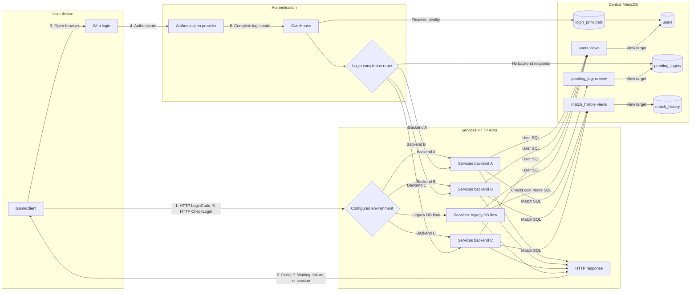

# GateHouse

GateHouse brokers browser login for
[GeneralsOnline Services](https://github.com/GeneralsOnlineDevelopmentTeam/Services).
It can use the existing GeneralsOnline login or authenticate users through
GameReplays, Discord, and Steam.

Each provider account gets its own local numeric user ID; account linking is
disabled. On first sign-in, users choose a display name. GateHouse then sends
the completed login to the right Services backend. If no backend accepts it,
GateHouse writes it to `pending_logins` for the legacy database-backed flow.

## Login flow



## Login providers

Providers and their credentials are configured in
[`config.example.yaml`](config.example.yaml). The built-in protocols cover the
existing GeneralsOnline redirect, OAuth 2.0, and Steam OpenID 2.0. Steam does
not require an API key.

The game opens `/login?gamecode=...&env=...`; both values are required. There is
no provider-initiated login or default environment. To skip the provider
picker, open `/login/{provider}?gamecode=...&env=...`. OAuth and OpenID
providers return to `/login/{provider}/return`. Use these values when
registering a provider:

```text
Origin:     https://gatehouse.example.com
Return URL: https://gatehouse.example.com/login/{provider}/return
```

`login_principals` stores only the provider's stable account ID. Usernames,
email addresses, and display names returned by providers are ignored. Its
unique `user_id` keeps provider accounts separate. The enabled `go_redirect`
provider's configuration key is used as the issuer, so do not rename it after
users have signed in.

Display names are unique and limited to 3–16 ASCII characters. The form shows
the permitted punctuation, validates as the user types, and can roll an
editable suggestion. GateHouse validates again and checks availability on
submit.

Branding, colors, and provider icons are configured under `authentication.ui`
and `authentication.providers`.

## HTTP API

| Method | Path                                      | Purpose                              |
| ------ | ----------------------------------------- | ------------------------------------ |
| `POST` | `/LoginCode`                              | Complete a login (`env` in body)     |
| `POST` | `/env/{environment}/contract/1/LoginCode` | Complete a login (`env` in path)     |
| `GET`  | `/healthz`                                | Process liveness                     |
| `GET`  | `/readyz`                                 | MySQL readiness                      |

The two login completion routes accept the result of web authentication and
require `X-Api-Key`. The game gets a code from Services, opens the browser, and
polls `CheckLogin` while GateHouse delivers the result.

A backend delivery returns `204`. The `pending_logins` fallback returns `202`.
`X-Gatehouse-Delivery` identifies the path used.

### Login completion payload

```json
{
  "env": "example_alpha",
  "code": "0123456789ABCDEF0123456789ABCDEF",
  "user_id": 34621,
  "success": true
}
```

- `env`: 1-64 lowercase letters, digits, underscores, or hyphens.
- `code`: 1-32 ASCII letters or digits; normalized to uppercase.
- `user_id`: required and positive on success; failed callbacks may use `-1`.
- `success`: boolean.

For GeneralsOnline, the incoming `user_id` is the upstream ID. GateHouse maps it
through the enabled `go_redirect` provider and delivers the local user ID.
Browser providers do not send this payload; GateHouse creates it after their
callback. No additional properties are forwarded.

## Configuration

Copy [`config.example.yaml`](config.example.yaml), set its public URL and
credentials, then:

```bash
export GATEHOUSE_CONFIG=./config.yaml
go run ./cmd/gatehouse
```

Credentials may be set directly or through their `*_file` alternative. The
inbound key must be at least 32 characters; generate one with
`openssl rand -hex 32`. For development only, set
`allow_unsafe_inbound_api_key: true` or
`GATEHOUSE_ALLOW_UNSAFE_INBOUND_API_KEY=true` to bypass the key length and
placeholder checks. GateHouse logs a warning whenever this override is enabled.
Scalar overrides are:

`GATEHOUSE_LISTEN_ADDRESS`, `GATEHOUSE_MYSQL_DSN`,
`GATEHOUSE_MYSQL_DSN_FILE`, `GATEHOUSE_INBOUND_API_KEY`,
`GATEHOUSE_INBOUND_API_KEY_FILE`,
`GATEHOUSE_ALLOW_UNSAFE_INBOUND_API_KEY`, `GATEHOUSE_DOCKER_HOST`,
`GATEHOUSE_BACKEND_TIMEOUT`, `GATEHOUSE_SHUTDOWN_TIMEOUT`,
`GATEHOUSE_MAX_CALLBACK_BODY_BYTES`, and
`GATEHOUSE_MYSQL_ADVISORY_LOCK_TIMEOUT_SECONDS`.

### Container quick start

Images are published with `latest` and short-commit tags for `linux/amd64` and
`linux/arm64`. With `config.yaml` prepared:

```yaml
services:
  gatehouse:
    image: ghcr.io/community-outpost/gatehouse:latest
    restart: unless-stopped
    init: true
    read_only: true
    cap_drop:
      - ALL
    security_opt:
      - no-new-privileges:true
    environment:
      GATEHOUSE_CONFIG: /etc/gatehouse/config.yaml
    volumes:
      - ./config.yaml:/etc/gatehouse/config.yaml:ro
      - /var/run/docker.sock:/var/run/docker.sock:ro
    group_add:
      - "$DOCKER_GID"
    ports:
      - "127.0.0.1:8080:8080"
    networks:
      - gatehouse

networks:
  gatehouse:
    name: gatehouse
```

`group_add` lets the non-root container user access the mounted Docker socket:

```bash
export DOCKER_GID=$(stat -c '%g' /var/run/docker.sock)
docker compose up -d
```

Discovered backends must join the configured `gatehouse` network. If discovery
is disabled, remove the socket mount and `group_add`. For production discovery,
prefer a restricted socket proxy over mounting the Docker socket directly.

### Static backends

```yaml
backends:
  static:
    example_alpha:
      callback_url: https://backend.example.com/LoginCode
      api_key_file: /run/secrets/example_alpha_api_key
    example_private:
      callback_url: https://private.example.com/auth/LoginCode
      api_key_file: /run/secrets/example_private_api_key
```

Each backend needs its own API key; GateHouse never forwards its inbound key.
A discovered backend without a key is skipped and delivery falls back to
`pending_logins`. Static backends take precedence over Docker discovery.

### Docker discovery

```yaml
labels:
  com.community-outpost.gatehouse.environment: example_alpha
```

The environment label enables discovery. Optional label suffixes override
Docker defaults:

| Label suffix | Meaning                                                          |
| ------------ | ---------------------------------------------------------------- |
| `.scheme`    | `http` or `https`                                                |
| `.port`      | Backend port                                                     |
| `.path`      | Callback path; may contain `{environment}`                       |

`backends.docker.overrides` takes precedence over labels and is the only place
to configure a discovered backend's API key or host. Duplicate environments
are round-robin. Prefer rootless Docker/Podman or a private
[socket proxy](https://github.com/Tecnativa/docker-socket-proxy) limited to
container `GET`/`HEAD` requests.

## MySQL setup

GateHouse does not create its own schema. A greenfield setup uses central
`users`, `login_principals`, `pending_logins`, and `match_history` tables. Each
Services database reaches `users`, `pending_logins`, and `match_history` through
views; `external_publication` stays local to that Services database.

### 1. Create the central tables

```sql
CREATE TABLE gatehouse.users (
  user_id BIGINT NOT NULL AUTO_INCREMENT,
  account_type INT NOT NULL,
  steam_id BIGINT NULL,
  discord_id BIGINT NULL,
  discord_username VARCHAR(32) NULL,
  gamereplays_id BIGINT NULL,
  gamereplays_username VARCHAR(32) NULL,
  displayname VARCHAR(32) NOT NULL,
  lastlogin DATETIME(6) NOT NULL DEFAULT '1970-01-01 00:00:00.000000',
  last_ip VARCHAR(45) NULL,
  client_id INT NOT NULL DEFAULT 5,
  favorite_color INT NOT NULL DEFAULT -1,
  favorite_side INT NOT NULL DEFAULT -1,
  favorite_map VARCHAR(128) NULL,
  favorite_starting_money INT NOT NULL DEFAULT -1,
  favorite_limit_superweapons TINYINT(1) NOT NULL DEFAULT 0,
  admin TINYINT(1) NOT NULL DEFAULT 0,
  banned TINYINT(1) NOT NULL DEFAULT 0,
  elo_rating INT NOT NULL DEFAULT 1000,
  monthly_elo_rating INT NOT NULL DEFAULT 1000,
  elo_num_matches INT NOT NULL DEFAULT 0,
  ban_reason VARCHAR(128) NULL,
  banned_by VARCHAR(50) NULL,
  ban_verified_by VARCHAR(50) NULL,
  ban_aliases VARCHAR(50) NULL,
  PRIMARY KEY (user_id),
  UNIQUE KEY uq_users_displayname (displayname),
  CONSTRAINT chk_users_displayname_safe
    CHECK (
      CHAR_LENGTH(displayname) BETWEEN 3 AND 16
      AND displayname REGEXP
        '^[A-Za-z0-9_.(){}!?@#$%^&*+=~''\\[\\]-]+( [A-Za-z0-9_.(){}!?@#$%^&*+=~''\\[\\]-]+)*$'
    )
) ENGINE=InnoDB
  DEFAULT CHARACTER SET utf8mb4
  COLLATE utf8mb4_general_ci;

CREATE TABLE gatehouse.login_principals (
  issuer VARCHAR(64) CHARACTER SET ascii COLLATE ascii_bin NOT NULL,
  subject VARCHAR(255) CHARACTER SET utf8mb4 COLLATE utf8mb4_bin NOT NULL,
  user_id BIGINT NOT NULL,
  created_at DATETIME(6) NOT NULL DEFAULT CURRENT_TIMESTAMP(6),
  PRIMARY KEY (issuer, subject),
  UNIQUE KEY uq_login_principals_user_id (user_id),
  CONSTRAINT fk_login_principals_user
    FOREIGN KEY (user_id) REFERENCES gatehouse.users (user_id)
) ENGINE=InnoDB
  DEFAULT CHARACTER SET utf8mb4
  COLLATE utf8mb4_bin;

CREATE TABLE gatehouse.pending_logins (
  code VARCHAR(32) NOT NULL,
  state INT NOT NULL,
  created DATETIME NOT NULL DEFAULT CURRENT_TIMESTAMP,
  user_id BIGINT NOT NULL,
  PRIMARY KEY (code)
) ENGINE=InnoDB
  DEFAULT CHARACTER SET utf8mb4
  COLLATE utf8mb4_general_ci;

CREATE TABLE gatehouse.match_history (
  match_id BIGINT NOT NULL AUTO_INCREMENT,
  owner BIGINT NOT NULL,
  name VARCHAR(64) NOT NULL,
  finished TINYINT(1) NOT NULL DEFAULT 0,
  started DATETIME NOT NULL DEFAULT CURRENT_TIMESTAMP,
  time_finished DATETIME NOT NULL DEFAULT CURRENT_TIMESTAMP,
  map_name VARCHAR(128) NOT NULL,
  map_official TINYINT(1) NOT NULL,
  match_roster_type VARCHAR(32) NOT NULL DEFAULT '',
  lobby_type TINYINT(3) UNSIGNED NULL,
  vanilla_teams TINYINT(1) NOT NULL,
  starting_cash INT(10) UNSIGNED NOT NULL,
  limit_superweapons TINYINT(1) NOT NULL,
  track_stats TINYINT(1) NOT NULL,
  allow_observers TINYINT(1) NOT NULL,
  max_cam_height SMALLINT(6) UNSIGNED NOT NULL,
  exe_crc INT(10) UNSIGNED NOT NULL DEFAULT 0,
  ini_crc INT(10) UNSIGNED NOT NULL DEFAULT 0,
  map_path VARCHAR(128) NULL,
  member_slot_0 LONGTEXT CHARACTER SET utf8mb4 COLLATE utf8mb4_bin NULL CHECK (JSON_VALID(member_slot_0)),
  member_slot_1 LONGTEXT CHARACTER SET utf8mb4 COLLATE utf8mb4_bin NULL CHECK (JSON_VALID(member_slot_1)),
  member_slot_2 LONGTEXT CHARACTER SET utf8mb4 COLLATE utf8mb4_bin NULL CHECK (JSON_VALID(member_slot_2)),
  member_slot_3 LONGTEXT CHARACTER SET utf8mb4 COLLATE utf8mb4_bin NULL CHECK (JSON_VALID(member_slot_3)),
  member_slot_4 LONGTEXT CHARACTER SET utf8mb4 COLLATE utf8mb4_bin NULL CHECK (JSON_VALID(member_slot_4)),
  member_slot_5 LONGTEXT CHARACTER SET utf8mb4 COLLATE utf8mb4_bin NULL CHECK (JSON_VALID(member_slot_5)),
  member_slot_6 LONGTEXT CHARACTER SET utf8mb4 COLLATE utf8mb4_bin NULL CHECK (JSON_VALID(member_slot_6)),
  member_slot_7 LONGTEXT CHARACTER SET utf8mb4 COLLATE utf8mb4_bin NULL CHECK (JSON_VALID(member_slot_7)),
  PRIMARY KEY (match_id)
) ENGINE=InnoDB
  DEFAULT CHARACTER SET utf8mb4
  COLLATE utf8mb4_general_ci;
```

The provider-specific columns in `users` remain for Services compatibility;
GateHouse does not use them. All environments share `match_history` and its ID
sequence.

A fresh table starts at match ID `1`. To continue an existing public sequence,
import any old rows first, find the next ID, and set it before starting Services:

```sql
SELECT COALESCE(MAX(match_id), 0) + 1 AS next_match_id
FROM gatehouse.match_history;

-- Replace 1000000 with that result, or with the next externally assigned ID.
ALTER TABLE gatehouse.match_history AUTO_INCREMENT = 1000000;
```

Run this once on the shared table, not once per environment.

### 2. Create the GateHouse database user

Generate a password with `openssl rand -hex 32`:

```sql
CREATE USER 'gatehouse'@'%' IDENTIFIED BY 'CHANGE_ME';

GRANT SELECT, INSERT, UPDATE
  ON gatehouse.users TO 'gatehouse'@'%';
GRANT SELECT, INSERT
  ON gatehouse.login_principals TO 'gatehouse'@'%';
GRANT INSERT, DELETE
  ON gatehouse.pending_logins TO 'gatehouse'@'%';
```

Restrict `%` to the GateHouse host or subnet where possible.

### 3. Link a Services instance database

For a greenfield Services database named `go_alpha`, create these views instead
of local `users`, `pending_logins`, and `match_history` tables:

```sql
CREATE OR REPLACE
  ALGORITHM = MERGE
  SQL SECURITY INVOKER
VIEW go_alpha.users AS
SELECT
  user_id,
  account_type,
  steam_id,
  discord_id,
  discord_username,
  gamereplays_id,
  gamereplays_username,
  displayname,
  lastlogin,
  last_ip,
  client_id,
  favorite_color,
  favorite_side,
  favorite_map,
  favorite_starting_money,
  favorite_limit_superweapons,
  admin,
  banned,
  elo_rating,
  monthly_elo_rating,
  elo_num_matches,
  ban_reason,
  banned_by,
  ban_verified_by,
  ban_aliases
FROM gatehouse.users;

CREATE OR REPLACE
  ALGORITHM = MERGE
  SQL SECURITY INVOKER
VIEW go_alpha.pending_logins AS
SELECT code, state, created, user_id
FROM gatehouse.pending_logins;

CREATE OR REPLACE
  ALGORITHM = MERGE
  SQL SECURITY INVOKER
VIEW go_alpha.match_history AS
SELECT *
FROM gatehouse.match_history;
```

`match_history` is shared across environments. Its view remains writable, so
Services can insert matches and receive generated IDs. Leave the
Services-created `external_publication` table local to each Services database.

### 4. Create the Services database user

```sql
CREATE USER 'go_alpha'@'%' IDENTIFIED BY 'CHANGE_ME';

GRANT SELECT, INSERT, UPDATE, DELETE
  ON go_alpha.* TO 'go_alpha'@'%';

GRANT SELECT, INSERT, UPDATE
  ON gatehouse.users TO 'go_alpha'@'%';
GRANT SELECT, INSERT, UPDATE, DELETE
  ON gatehouse.pending_logins TO 'go_alpha'@'%';
GRANT SELECT, INSERT, UPDATE
  ON gatehouse.match_history TO 'go_alpha'@'%';
```

Use a separate database and account for each instance. Restrict `%` to the
instance host or subnet where possible.

## Reverse proxies and logging

Only CIDRs in `trusted_proxies` may supply `X-Forwarded-For` or
`X-Real-Ip`; other forwarding headers are ignored.

JSON logs omit request bodies, query strings, and `X-Api-Key`. Configure the
reverse proxy to omit or redact query strings as well: login URLs contain a
short-lived game code. Terminate TLS at the proxy and rate-limit public
`/login` routes; GateHouse also caps concurrent login requests.

## Build and test

```bash
go test ./...
go vet ./...
go run golang.org/x/vuln/cmd/govulncheck@v1.7.0 ./...
go run github.com/securego/gosec/v2/cmd/gosec@v2.29.0 ./...
go build ./cmd/gatehouse
docker build -t gatehouse .
```

CI runs the tests, vet, and security scans above. Pushes to the default branch
publish `latest` and short-commit tags to
`ghcr.io/community-outpost/gatehouse`.
