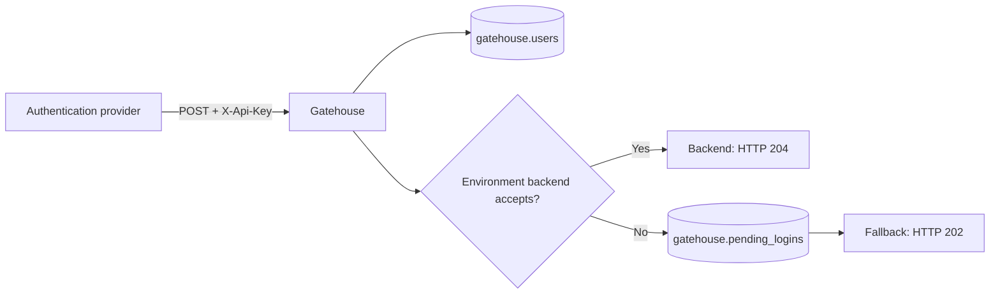
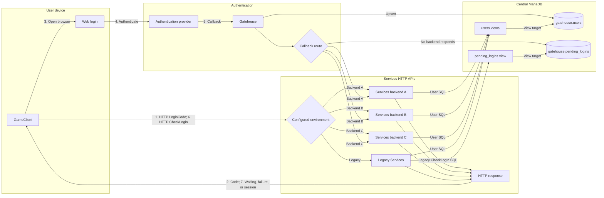

# Gatehouse

Gatehouse is a centralized user store and authentication bridge for
[GeneralsOnline Services](https://github.com/GeneralsOnlineDevelopmentTeam/Services)
and the legacy
[GameClient](https://github.com/GeneralsOnlineDevelopmentTeam/GameClient).
For a new positive user ID it creates a minimal `users` row with
`account_type = -1` and a generated display name. It then forwards the callback
to an environment backend or falls back to `pending_logins`. Existing users
are unchanged. Delivery is at-least-once.



## Login flow



## HTTP API

| Method | Path                                      | Purpose                           |
| ------ | ----------------------------------------- | --------------------------------- |
| `POST` | `/LoginCode`                              | Canonical authentication callback |
| `POST` | `/env/{environment}/contract/1/LoginCode` | Services-compatible callback      |
| `GET`  | `/healthz`                                | Process liveness                  |
| `GET`  | `/readyz`                                 | MySQL readiness                   |

Callback endpoints require `X-Api-Key`. Backend delivery returns `204`;
MySQL fallback returns `202`. `X-Gatehouse-Delivery` identifies `backend` or
`mysql-fallback`.

### Callback contract

```json
{
  "env": "example_alpha",
  "code": "0123456789ABCDEF0123456789ABCDEF",
  "user_id": 34621,
  "success": true
}
```

- `env`: 1-64 lowercase letters, digits, underscores, or hyphens.
- `code`: 1-32 ASCII letters or digits; normalized to uppercase.
- `user_id`: required and positive on success; failed callbacks may use `-1`.
- `success`: boolean.

Additional JSON properties pass through unchanged. Account type and provider
metadata will be upserted once those callback fields and linking rules are
defined.

## Configuration

Copy [`config.example.yaml`](config.example.yaml), set its credentials, then:

```bash
export GATEHOUSE_CONFIG=./config.yaml
go run ./cmd/gatehouse
```

Use either a literal secret or its `*_file` alternative. Scalar overrides are
`GATEHOUSE_LISTEN_ADDRESS`, `GATEHOUSE_MYSQL_DSN`,
`GATEHOUSE_MYSQL_DSN_FILE`, `GATEHOUSE_INBOUND_API_KEY`,
`GATEHOUSE_INBOUND_API_KEY_FILE`, `GATEHOUSE_DOCKER_HOST`,
`GATEHOUSE_BACKEND_TIMEOUT`, `GATEHOUSE_SHUTDOWN_TIMEOUT`,
`GATEHOUSE_MAX_CALLBACK_BODY_BYTES`, and
`GATEHOUSE_MYSQL_ADVISORY_LOCK_TIMEOUT_SECONDS`.

### Container quick start

Images use `latest` and short-commit tags for `linux/amd64` and
`linux/arm64`. With `config.yaml` prepared:

```yaml
services:
  gatehouse:
    image: ghcr.io/community-outpost/gatehouse:latest
    restart: unless-stopped
    init: true
    read_only: true
    cap_drop:
      - ALL
    security_opt:
      - no-new-privileges:true
    environment:
      GATEHOUSE_CONFIG: /etc/gatehouse/config.yaml
    volumes:
      - ./config.yaml:/etc/gatehouse/config.yaml:ro
      - /var/run/docker.sock:/var/run/docker.sock:ro
    group_add:
      - "$DOCKER_GID"
    ports:
      - "127.0.0.1:8080:8080"
    networks:
      - gatehouse

networks:
  gatehouse:
    name: gatehouse
```

`group_add` lets the non-root container user access the mounted Docker socket:

```bash
export DOCKER_GID=$(stat -c '%g' /var/run/docker.sock)
docker compose up -d
```

Discovered backends must join the configured `gatehouse` network. Remove the
socket mount and `group_add` with a socket proxy or disabled discovery.

### Static backends

```yaml
backends:
  static:
    example_alpha:
      callback_url: https://backend.example.com/LoginCode
    example_private:
      callback_url: https://private.example.com/auth/LoginCode
      api_key_file: /run/secrets/example_private_api_key
```

Without a backend key, Gatehouse passes through the inbound key. Static
backends take precedence over Docker discovery.

### Docker discovery

```yaml
labels:
  com.community-outpost.gatehouse.environment: example_alpha
```

The environment label enables discovery. Optional label suffixes override
Docker defaults:

| Label suffix | Meaning                                                          |
| ------------ | ---------------------------------------------------------------- |
| `.scheme`    | `http` or `https`                                                |
| `.host`      | Hostname or IP instead of the selected container-network address |
| `.port`      | Backend port                                                     |
| `.path`      | Callback path; may contain `{environment}`                       |

`backends.docker.overrides` wins over labels and may set the API key; labels
never contain keys. Duplicate environments are round-robin. Prefer rootless
Docker/Podman or a private
[socket proxy](https://github.com/Tecnativa/docker-socket-proxy) limited to
container `GET`/`HEAD` requests.

## MySQL setup

Gatehouse does not manage schema. It uses central `users` and `pending_logins`
tables; each Services database exposes them through cross-database views.

### 1. Create the central tables

```sql
CREATE TABLE gatehouse.users (
  user_id BIGINT NOT NULL AUTO_INCREMENT,
  account_type INT NOT NULL,
  steam_id BIGINT NULL,
  discord_id BIGINT NULL,
  discord_username VARCHAR(32) NULL,
  gamereplays_id BIGINT NULL,
  gamereplays_username VARCHAR(32) NULL,
  displayname VARCHAR(32) NOT NULL,
  lastlogin DATETIME(6) NOT NULL DEFAULT '1970-01-01 00:00:00.000000',
  last_ip VARCHAR(45) NULL,
  client_id INT NOT NULL DEFAULT 5,
  favorite_color INT NOT NULL DEFAULT -1,
  favorite_side INT NOT NULL DEFAULT -1,
  favorite_map VARCHAR(128) NULL,
  favorite_starting_money INT NOT NULL DEFAULT -1,
  favorite_limit_superweapons TINYINT(1) NOT NULL DEFAULT 0,
  admin TINYINT(1) NOT NULL DEFAULT 0,
  banned TINYINT(1) NOT NULL DEFAULT 0,
  elo_rating INT NOT NULL DEFAULT 1000,
  monthly_elo_rating INT NOT NULL DEFAULT 1000,
  elo_num_matches INT NOT NULL DEFAULT 0,
  ban_reason VARCHAR(128) NULL,
  banned_by VARCHAR(50) NULL,
  ban_verified_by VARCHAR(50) NULL,
  ban_aliases VARCHAR(50) NULL,
  PRIMARY KEY (user_id)
) ENGINE=InnoDB
  DEFAULT CHARACTER SET utf8mb4
  COLLATE utf8mb4_general_ci;

CREATE TABLE gatehouse.pending_logins (
  code VARCHAR(32) NOT NULL,
  state INT NOT NULL,
  created DATETIME NOT NULL DEFAULT CURRENT_TIMESTAMP,
  user_id BIGINT NOT NULL,
  PRIMARY KEY (code)
) ENGINE=InnoDB
  DEFAULT CHARACTER SET utf8mb4
  COLLATE utf8mb4_general_ci;
```

### 2. Create the Gatehouse database user

Generate a password with `openssl rand -hex 32`:

```sql
CREATE USER 'gatehouse'@'%' IDENTIFIED BY 'CHANGE_ME';

GRANT INSERT, UPDATE
  ON gatehouse.users TO 'gatehouse'@'%';
GRANT INSERT, DELETE
  ON gatehouse.pending_logins TO 'gatehouse'@'%';
```

Restrict `%` to the Gatehouse host or subnet where possible.

### 3. Link a Services instance database

For Services database `go_alpha`, migrate its existing user/login rows into
`gatehouse`, replace its two local tables with these views:

```sql
CREATE OR REPLACE
  ALGORITHM = MERGE
  SQL SECURITY INVOKER
VIEW go_alpha.users AS
SELECT
  user_id,
  account_type,
  steam_id,
  discord_id,
  discord_username,
  gamereplays_id,
  gamereplays_username,
  displayname,
  lastlogin,
  last_ip,
  client_id,
  favorite_color,
  favorite_side,
  favorite_map,
  favorite_starting_money,
  favorite_limit_superweapons,
  admin,
  banned,
  elo_rating,
  monthly_elo_rating,
  elo_num_matches,
  ban_reason,
  banned_by,
  ban_verified_by,
  ban_aliases
FROM gatehouse.users;

CREATE OR REPLACE
  ALGORITHM = MERGE
  SQL SECURITY INVOKER
VIEW go_alpha.pending_logins AS
SELECT code, state, created, user_id
FROM gatehouse.pending_logins;
```

### 4. Create the Services database user

```sql
CREATE USER 'go_alpha'@'%' IDENTIFIED BY 'CHANGE_ME';

GRANT SELECT, INSERT, UPDATE, DELETE
  ON go_alpha.* TO 'go_alpha'@'%';

GRANT SELECT, INSERT, UPDATE
  ON gatehouse.users TO 'go_alpha'@'%';
GRANT SELECT, INSERT, UPDATE, DELETE
  ON gatehouse.pending_logins TO 'go_alpha'@'%';
```

Use a unique database and account per instance, and restrict `%` to its host
or subnet where possible.

## Reverse proxies and logging

Only CIDRs in `trusted_proxies` may supply `X-Forwarded-For` or
`X-Real-Ip`; other forwarding headers are ignored.

JSON logs go to stdout and include callback bodies up to
`max_callback_body_bytes`, but never `X-Api-Key`. Restrict log access and
retention. Terminate TLS upstream, use strong keys, and prefer secret files.

## Build and test

```bash
go test ./...
go vet ./...
go build ./cmd/gatehouse
docker build -t gatehouse .
```

Pull requests run tests and vetting only. Default-branch pushes publish
`ghcr.io/community-outpost/gatehouse` with `latest` and short-commit tags.
